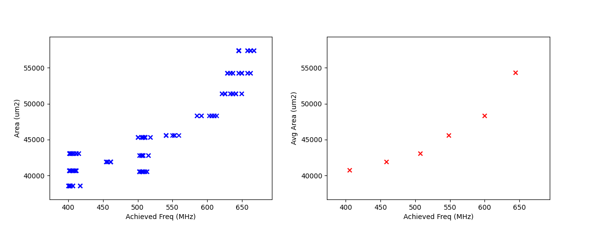

# COFFE Documentation

## Getting Started:

1. To set up your coffe environment make sure conda is installed on your system and run the following command from the top level COFFE repo:
    
    
    ```bash
    conda env create --file=conda_env/env.yaml
    ```
    
2. This should create a conda environment which can be activated by running:
    
    ```bash
    source activate coffe-env
    ```
    

## COFFE Full Custom Flow Usage:

- The full custom flow refers to COFFE performing transistor sizing for FPGA peripheral circuits based on user provided parameters.
- COFFE also supports an ASIC flow isolated from the transistor sizing portion hence the distinction.
1. Make sure that your environment contains the “hspice” tool. This can be tested by running the following command:
    
    ```bash
    which hspice
    ```
    
    It should show the path in which hspice is installed, if not COFFE will not work.
    
2. Set up an input configuration YAML file. A good place to look to start is under the “~/COFFE/unit_tests/input_files/flut0.yaml” path and look at the below parameter reference to figure out which ones you want to change for your desired FPGA architecture. The flut0 design is that of a fracturable lookup table using a 22nm process. If interested at other process nodes the spice decks can be found at [ptm.asu.edu](http://ptm.asu.edu/)
3. Once the configuration file is setup you can run the following command (using the flut0.yaml as an example):
    
    ```bash
    python3 coffe.py -i 4 unit_tests/input_files/custom_flow/flut0.yaml
    ```
    
4. This command may take hours to complete but once it is done you can compare the results with those found in ~/COFFE/unit_tests/test_results_archive/custom_flow_results/flut_report.txt

## COFFE Heterogenous (Full Custom + Hardblock) Flow Usage:

1. Make sure that your environment contains the following ASIC tools. This can be tested by running the following commands:
    
    ```bash
    which hspice
    which dc_shell-t
    #if using encounter for place and route
    which encounter
    #if using innovus for place and route (requires genus as well)
    which innovus
    which genus
    ```
    
2. Set up an input configuration YAML file. A good reference is the under the following path: “~/COFFE/unit_tests/input_files/stdcell_flow/strtx_III_dsp_coffe_settings.yaml” This has the settings to run a stratix III like dsp through the heterogenous flow. 
    1. The default settings are using a TSMC 65nm process so the results should be directly comparable to those in the stratix III architecture. However, anyone who is not using UofT infrastructure needs to change all process specific parameters to the PDK of their choice. Other comparisons can be made to results in COFFE 2 [4].
    2. ASIC flow results can be compared to table and figures found in ~/COFFE/analyze_results/results_archive
3. Once the config file is ready to you can run the following command:
    
    ```bash
    python3 coffe.py -i 4 unit_tests/input_files/stdcell_flow/strtx_III_dsp_coffe_settings.yaml
    ```
    

## COFFE Solo ASIC Flow Usage:

1. Follow steps 1-2 on Heterogenous flow.

### ASIC Flow Structure

The ASIC flow that COFFE supports can be run in serial or parallel mode, each of which can run in generic or hierarchical mode.  

- This guide will go through parallel and hierarchical flows as the serial flow is done in the heterogenous flow.

Below are brief flowcharts of each of the flows denoting parallelism across input sweep parameters and arrows denoting dependencies (In serial mode there is no parallelism):

- Generic Flow: [synth] → [pnr] → [pt]
- Hierarchical Flow:
    
     [synth] → [floorplan generation → partitioning → [per_block_pnr …] → top_level_pnr → assembly] → [pt]
    

The flow starts by writing scripts for each stage (synth, pnr, power & timing ). The scripts are generated into the following directory structure, specified by the following asic_hardblock_params:

```yaml
"parallel_hardblock_folder"
->“top_level”
--->synth
-------->parameterized_dir
------------>outputs
------------>reports
------------>work
------------>scripts
--->pnr
..... Same as above structure....
--->sta
......Same as above structure....
```

The naming convention for the parameterized dir is as follows:

“period_X_wiremdl_X_mlayer_X_util_X”

- For all combinations of parameters in the hb_run_params parameter (under “asic_hardblock_params” namespace in list of hardblocks), there will be scripts generated in its respective parameterized directory. After all scripts are generated the write_parallel_scripts() function is called, for each flow stage, a parallel work directory is created and a bash script is written to change to each parameterized work directory and run the appropriate command or set of commands.

Ex. period_0.6_wiremdl_WireAreaLowkAgr_synth_run_parallel.sh:

```bash
cd /autofs/fs1.ece/fs1.eecg.vaughn/morestep/COFFE/output_files/network_on_chip/asic_work/router_wrap/synth/period_0.6_wiremdl_WireAreaLowkAgr/work
dc_shell-t -f ../scripts/dc_script.tcl > dc.log
```

- A top level script is also generated to call all of the parameter specific scripts in parallel and wait for them all to finish execution

Ex. top_level_parallel.sh:

```bash
#!/bin/bash
scripts/period_0.6_wiremdl_WireAreaLowkAgr_synth_run_parallel.sh &
#... other run parameters
#... other run parameters
#...
wait
```

- These scripts will parse a directory taken in from the hardblock_run_settings file which provide a subset of parameters in the hardblock_settings file and determines the parameters which the user would like to execute flow for. The top_level_parallel.sh script will be run for each stage.

Example of hb_run_params parameter:

```yaml
hb_run_params:
        param_filters: 
          period : ["1.53"]
          wiremdl : ["WireAreaLowkCon"]
          mlayer : ["8"]
          util : ["0.85"]
        synth :
          run_flag : True
        pnr:
          run_flag : True
          override_outputs : False
        sta:
          run_flag : True
```

- Each of the param_filters settings are strings which will look at all generated parameterized directories and will only run the flow on ones which have matching parameters to the strings contained in param_filters.
- The option to separate the parameters which generate the flow scripts with the parameters for a particular asic flow run are from the desire be able to keep the whole range of testing parameters constant while testing subsets, as each hierarchical place and route flow run can take a while.

### Parallel/Hierarchical Flow Usage:

An example of the heirarchical flow can be seen from the configuration file at the following path: ~/COFFE/unit_tests/input_files/stdcell_flow/noc_coffe_settings.yaml

- To generate all scripts to the “parallel_hardblock_folder” parameter run the following command:

```bash
python3 coffe.py -ho -g unit_tests/input_files/stdcell_flow/strtx_III_dsp_coffe_settings.yaml
```

- To run the parallel flow in the parallel working directory (“parallel_hardblock_folder” parameter) run the following command:

```bash
python3 coffe.py -ho -p unit_tests/input_files/stdcell_flow/strtx_III_dsp_coffe_settings.yaml
```

- Once the flow is complete, the results can be parsed and generated into “condensed_results_folder” parameter the with the following command:

```bash
python3 coffe.py -ho -r unit_tests/input_files/stdcell_flow/strtx_III_dsp_coffe_settings.yaml
```

### Hierarchical Flow Description:

Looking into the file you should see a ptn_params section:

```yaml
############################################ INFO ############################################
      #Contains settings for floorplanning and partitioning in pnr flow
      ############################################ INFO ############################################
      ptn_params:
        ################## FLOORPLANNING SETTINGS #################
        #scaled array used as higher level param in ptn_settings dict
        #use below format for lists related to key on left
        ################## THESE CAN BE USED FOR GEN AND RUN SETTINGS #########################
        top_settings:
          scaling_array : [1]
          fp_init_dims : [948.4,947.0]
          fp_pin_spacing : 5
        #Specifies individual partitions to be created
        partitions:
          - inst_name : gen_port_regs[1].channel_in_ff
            mod_name : c_dff_1_7
            fp_coords : [43.0, 920.0, 68.0, 953.0]
          - inst_name: gen_port_regs[1].channel_out_ff
            mod_name: c_dff_1_6
            fp_coords: [73.0, 920.0, 98.0, 953.0]
          - inst_name: genblk2.vcr
            mod_name: vcr_top_1
            fp_coords: [100.0, 100.0, 440.0, 440.0]
          - inst_name: gen_port_regs[2].channel_in_ff
            mod_name: c_dff_1_5
            fp_coords: [927.0, 41.0, 956.0, 68.0]
          - inst_name: gen_port_regs[2].channel_out_ff
            mod_name: c_dff_1_4
            fp_coords:  [927.0, 73.0, 956.0, 100.0]
```

- The above “partition” blocks indicate partitions in the design and their respective module and instantiation names in the synthesized netlist. They also specify the floorplan coordinates in the [lc x, lc y, uc x, uc y] format.
- The partitioned flow is only different from the generic flow in the pnr stage. The scripts generated in the pnr stage are as follows:
- port_vars.tcl:
    - This script initializes the floorplan pin locations, it uses some rough estimates to place pins relative to the floorplan location/size of the top level router module (in this case the “vcr_top_1” module). The goal of this function is to assign pins s.t. links between routers are relatively straight from router to register partition to I/O. This script does not need to be run for every dimension length as the port assignments will stay constant.
    - The current function which generates these is write_edit_port_script_pre_ptn(), however, it is very design specific to the router implementation used and the default parameters set in the verilog source code.
- In a future PR it should be generalized to work for other designs/verilog parameters.
- The “scaling_array” parameter is parsed and is used to scale the “fp_init_dims” to create a range of link sizes.

For each floorplan dimension size, there is a series of partition scripts created:

- The “router_wrap” in below filenames is replaced by the hard_params[“top_level”] but I used router_wrap as its the design which was tested.
- router_wrap_dimlen_X_innovus_fp_gen.tcl:
    - The first is made by the write_innovus_fp() function. This script assigns the vertical and horizontal power routing, places IO pins and calls previously generated pin assignment script, this stage outputs a floorplan which is used in the subsequent partition script.
- router_wrap_dimlen_X_ptn.tcl:
    - The partition script is generated by the write_innovus_ptn_script() function. In this script the design partitions are created according to either the user defined floorplan settings or if the auto_assign_regs argument is asserted then the partitions are assigned corresponding to the previously generated floorplan IO pin locations and the dimension of the floorplan. This setting is currently limited in its generality and is not expected to work for large changes in the fp_pin spacing parameter, for large changes the user must edit the fp coordinates in the ptn_settings file.
    - The partition script creates hard fences around each of the specified design partitions and runs placement and optimization s.t timing budgets for partitions can be derived, the partition pins are then assigned and the partition directory is created with the associated design files for each block.
- router_wrap_dimlen_X_ptn_<mod_name>_block_flow.tcl:
    - For each of the partitions specified in the partition settings file, the full pnr flow needs to be run, and the design needs to be saved. The write_innovus_ptn_block_flow() writes the script which cds to the respective block directory in the previously generated partition script, uses the globals file to initialize design variables, loads the floorplan and runs the pnr flow in the following high level fashion:
        1. placement with preCTS optimization
        2. clock tree synthesis (CTS)
        3. postCTS optimization
        4. routing
        5. postRouting optimization
            1. The many optimization stages were introduced to have a higher chance of meeting timing and reducing DRC violations.
- router_wrap_dimlen_X_ptn_toplvl_flow.tcl:
    - The next stage is to run the flow for the top level implementation, in the example case this would be at the “router_wrap” level module. This script is generated by the write_innovus_ptn_top_level_flow() function.
    - The top level script first loads in the def file generated from the partition script and runs the following high level commands:
        1. clock_tree_synthesis
        2. postCTS optimization
        3. routing
        4. postRouting optimization
- router_wrap_dimlen_X_assembly_flow.tcl:
    - The final stage in the partition flow is assembly in which the previously generated top level and block level designs are all connected together, the only command run other than the assembly is postRouting optimization. This is generated in the write_innovus_assemble_script() function. Once assembly is complete the output netlist and all reports can be generated.

## Continuous Integration Usage:

- This section is a work in progress as results need to be compared manually, however, it will conveniently run all tests for which reference results exist
1. From the top level COFFE repo run the following commands:

```bash
cd unit_tests
python3 ci_tests.py -c <path/to/your/coffe/top/repo> -o all
# To run just custom flow
# python3 ci_tests.py -c <path/to/your/coffe/top/repo> -o custom
# To run just stdcell flow
# python3 ci_tests.py -c <path/to/your/coffe/top/repo> -o stdcell
```

## Reference Results:

### Full Custom Python2 → Python3 Results

| Test Name | Control Cost (Area x Delay)(python2) | Test Cost (Area x Delay)(python3) | Gate Length (nm) | Minimum Width Transistor Area (um^2) | Switch Type | Rest Length Factor | Vdd (V) | Vboost (V) | Transistor Type | Sizing Iterations |
| --- | --- | --- | --- | --- | --- | --- | --- | --- | --- | --- |
| flut0 | 0.19072 | 0.1903 | 22 | 33864 | pass transistor | 1 | 0.8 | 1.0 | Bulk | 4 |
| sram0 | 0.15121 | 0.15257 | 22 | 33864 | pass transistor | 1 | 0.8 | 1.0 | Bulk | 4 |
| mtj0 | 0.38429 | 0.39378 | 22 | 33864 | pass transistor | 1 | 0.8 | 1.0 | Bulk | 4 |
| fin_20_p_A | 0.03943 | 0.03985 | 20 | 13277 | pass transistor | 7 | 0.9 | 1.1 | Finfet | 4 |
| fin_20_p_B | N/A | 0.04024 | 20 | 13277 | pass transistor | 6 | 0.9 | 1.1 | Finfet | 4 |
| fin_20_p_C | 0.0424 | N/A | 20 | 13277 | pass transistor | 5 | 0.9 | 1.1 | Finfet | 4 |
| fin_20_t | 0.04071 | 0.04049 | 20 | 13277 | transmission gate | 10 | 0.9 | 1.1 | Finfet | 4 |
| fin_7_p | 0.00412 | 0.00419 | 20 | 2165 | pass transistor | 2 | 0.7 | 0.9 | Finfet | 4 |
| fin_7_t | 0.00439 | 0.00431 | 20 | 2165 | transmission gate | 5 | 0.7 | 0.9 | Finfet | 4 |

### Stratix-III-Like DSP ASIC Results:




### Hierarchical Flow NoC Router Results:

### NoC Configuration Settings:

- range of periods tested = [0.5,0.75,1,1.53, 2, 4]
- wireloadmodel = aggressive
- utilization = 0.70
- metal_layers = 8
- Used the partition fp coords defined in ptn_settings file
- "scaling_array" : [1,2,3,4,5,8,10]
- "fp_init_dims" : [948.4,947.0]
- "fp_pin_spacing" : "5"


## COFFE Configuration File Parameter Descriptions

- All FPGA architecture related parameters are stored under the namespace “fpga_arch_params”
- The following section will describe each parameter in the input yaml file and one can look to the provided example file to determine the corresponding datatype for each param.

### Utility Parameters:

| arch_out_folder | The directory in which output files will be stored. If not specified, the directory containing this file is used as output dir. |
| --- | --- |

### FPGA Architecture Parameters:

![COFFE’s expected input architecture parameters [[1]](https://www.eecg.utoronto.ca/~vaughn/papers/fpt2013_coffe.pdf)](imgs/Untitled%209.png)

COFFE’s expected input architecture parameters [[1]](https://www.eecg.utoronto.ca/~vaughn/papers/fpt2013_coffe.pdf)

### Memory Block Parameters:

Memory block parameters are used if one wants to model the FPGA BRAM.

![COFFE’s required inputs for modeling a BRAM [[2]](https://dl.acm.org/doi/10.1145/3020078.3021731) ](imgs/Untitled%2010.png)

COFFE’s required inputs for modeling a BRAM [[2]](https://dl.acm.org/doi/10.1145/3020078.3021731) 

### Custom Flow Process Technology Parameters:

| Parameter | Description |
| --- | --- |
| transistor_type | Can use “bulk” or “finfet” transistor |
| switch_type | Uses either “pass_transistor” or “transmission gate” in FPGA MUX/LUT circuitry. |
| vdd | FPGA supply voltage |
| vsram | Voltage of FPGA configuration SRAM cells (Importantly also the boost voltage for pass transistors) |
| vsram_n | SRAM cells VSS |
| gate_length | Gate length (in nm) of minimum size transistor |
| rest_length_factor | Factor which determines gate length of the level-restorer transistor in Figure 1a. length will be equal to “rest_length_factor” x “gate_length” |
| min_tran_width | Minimum transistor diffusion width (nm) |
| min_width_tran_area | Minimum-width transistor area (nm^2) |
| sram_cell_area | Area of a single SRAM cell in number of “min_width_tran_area” |
| model_path | Path to SPICE device model files |
| model_library | Library in model file to use |
| metal | List of metal layer RC values to use, the following rows in this table represent different metal layers |
| metal[0] | All wires except the general routing wires are implemented in this layer. |
| metal[1] | General routing wires will be implemented in this layer |
| metal[2] | Memory array wires will be implemented in this layer |
| metal[3] | This layer is used in MTJ wordline (if BRAM technology is MTJ) |

![Figure 1:  Transmission gate and pass transistor’s (a and b, respectively) used in mux and LUT Circuits [[3]](https://www.eecg.utoronto.ca/~vaughn/papers/fpl2013_tgate_fpgas.pdf)](imgs/Untitled%2011.png)

Figure 1:  Transmission gate and pass transistor’s (a and b, respectively) used in mux and LUT Circuits [[3]](https://www.eecg.utoronto.ca/~vaughn/papers/fpl2013_tgate_fpgas.pdf)

![Figure 2: Minimum Width Transistor Area Model [[1]](https://www.eecg.utoronto.ca/~vaughn/papers/fpt2013_coffe.pdf)](imgs/Untitled%2012.png)

Figure 2: Minimum Width Transistor Area Model [[1]](https://www.eecg.utoronto.ca/~vaughn/papers/fpt2013_coffe.pdf)

### Hardblock Parameters:

Legend:

- All parameters which will be swept geometrically are indicated with an asterisk as follows: “*”
    - This means that the synthesis flow will run for each entered value of these parameters
    - Ex: clock_period = [0.5, 1] the flow will get results for both periods
- The below parameters are used for the hardblocks users wish to have connected to the FPGA fabric.
- All hardblock parameters are in the “asic_hardblock_params” namespace, the only namespace which exists inside of the top level is a list of “hardblocks”. All of the following parameters will be contained in a single index of the “hardblocks” list.

![[[4]](https://dl.acm.org/doi/abs/10.1145/3301298) Select COFFE 2 Inputs for the Hybrid Flow](imgs/Untitled%2013.png)

[[4]](https://dl.acm.org/doi/abs/10.1145/3301298) Select COFFE 2 Inputs for the Hybrid Flow

### General Parameters:

| delay_cost_exp | The exponent of delay in the cost function |
| --- | --- |
| area_cost_exp | The exponent of area in the cost function |

![[[4]](https://dl.acm.org/doi/abs/10.1145/3301298) Select COFFE 2 Inputs for the Hybrid Flow](imgs/Untitled%2014.png)

[[4]](https://dl.acm.org/doi/abs/10.1145/3301298) Select COFFE 2 Inputs for the Hybrid Flow

### Utility Parameters:

| coffe_repo_path | Path to top level COFFE repo s.t plotting utility functions can be called |
| --- | --- |
| condensed_results_folder | Path to directory which will contain PPA results for each stage of ASIC flow for hardblock across all sweep of all input params |

### Parallel Flow Parameters:

| parallel_hardblock_folder | Path to dir containing all intermediate files for ASIC tools when running the parallel hardblock flow |
| --- | --- |
| mp_num_cores | maximum number of CPU cores allocated to parallel flow |

### Hierarchical Flow Parameters:

| partition_flag | If you wish to use the hierarchical flow {True | False} |
| --- | --- |
| ungroup_regex | This is a regular expression which matches to the names of all modules which you would like to keep grouped in the synthesis flow, it is required that all modules you wish to have in seperate partitions in place and route are matched by the regex |

### Design Specific Parameters:

| design_folder | path to directory containing all HDL design files (directory is searched recursively for all files with “design_language” extension |
| --- | --- |
| design_language | The design language. {verilog |  vhdl | sverilog} |
| clock_pin_name | Name of the clock pin in the design |
| top_level | Name of the top-level entity in the design |

### Synthesis:

### Process Specific Parameters:

| process_lib_paths | List of absolute paths to directories containing power_timing_noise information for the desired process |
| --- | --- |
| target_libraries | List of absolute paths to “.db” libraries used for power_timing_noise information |

### Design Parameters:

- These are also used in PrimeTime power analysis stage of flow

| clock_period* | List of clock periods (ns) |
| --- | --- |
| wire_selection* | List of wire loading models to be used |
| static_probability | The percentage of time circuit signals are in “1” state, used for power analysis |
| toggle_rate | The rate of 0→1 and 1→ 0 transistions in a period of time, used for power analysis |
| read_saif_file  | Use user provided saif file “saif.saif” for synthesis power analysis {True | False} Don’t use unless you want to look into the code (hardblock_functions.py) |
| generate_activity_file  | If you run simulation you can generate a vcd file {True | False} Don’t use unless you want to look into the code (hardblock_functions.py) |

### Utility Parameters:

| synth_folder | Folder in which synthesis reports and outputs are stored in serial flow |
| --- | --- |
| show_warnings | Show warnings during synthesis {True | False} |

### Place and Route:

### Process Specific Parameters:

| lef_files | List of absolute paths to all .lef files used in design |
| --- | --- |
| best_case_libs | List of absolute paths to all .lib files corresponding to standard cells used in design for best case corner |
| standard_libs | List of absolute paths to all .lib files corresponding to standard cells used in design for typical corner |
| worst_case_libs | List of absolute paths to all .lib files corresponding to standard cells used in design for worst case corner |

### Design Parameters:

| metal_layers* | List of highest metal layer allowed to be used in place and route (must be greater than length of metal_layer_names list) |
| --- | --- |
| core_utilization*  | List of utilization of core site |
| tilehi_tielo_cells_between_power_gnd | enable tie-high tie-low cells {True | False} |
| core_site_name | name of core site in floorplan, can be found in .lef files |
| power_ring_width | Width of VDD/VSS power ring around the core of the design (um) |
| power_ring_spacing | Amount of spacing added b/w power ring and core (um) |
| space_around_core | Amount of space the floorplan allocates around the core (Should be larger than 2 x power_ring_width + power_ring_spacing) |
| height_to_width_ratio | ratio of height to width of the floorplan, 1.0 indicates a square and 4.0 would indicate a rectangle who’s height is 4x its width |

### Layer Names:

| metal_layer_names | List of names of metal layers starting from the bottom-most layer on the left |
| --- | --- |
| power_ring_metal_layer_names | List of names of metal layers to use for each side of the power ring      order: top, bottom, left, right |
| filler_cell_names | List of filler cell names |

### Pin Names:

| gnd_net | Name of gnd_net found in library |
| --- | --- |
| gnd_pin | Name of gnd_pin found in library |
| pwr_net | Name of pwr_net found in library |
| pwr_pin | Name of pwr_pin found in library |

### Standard Cell Footprint Names:

| inv_footprint | Name of inverter cell, can be found in .lef files (optional) |
| --- | --- |
| buf_footprint | Name of buffer cell, can be found in .lef files (optional) |
| delay_footprint | Name of delay  cell, can be found in .lef files (optional) |

### Utility Parameters:

| pnr_tool | Choice of Cadence based pnr tool {innovus | encounter} |
| --- | --- |
| pr_folder | Folder in which place and route reports and outputs are stored in serial flow |
| map_file | Name of the file to use for layer mapping. Used for stream out. {<stream_out_fname | None } |

### Power and Timing Analysis Parameters:

### Process Specific Parameters:

| primetime_libs | list of “.db” libraries names used for timing/power analysis |
| --- | --- |

### Utility Parameters:

| primetime_folder | Folder in which power and timing analysis reports and outputs are stored in serial flow |
| --- | --- |